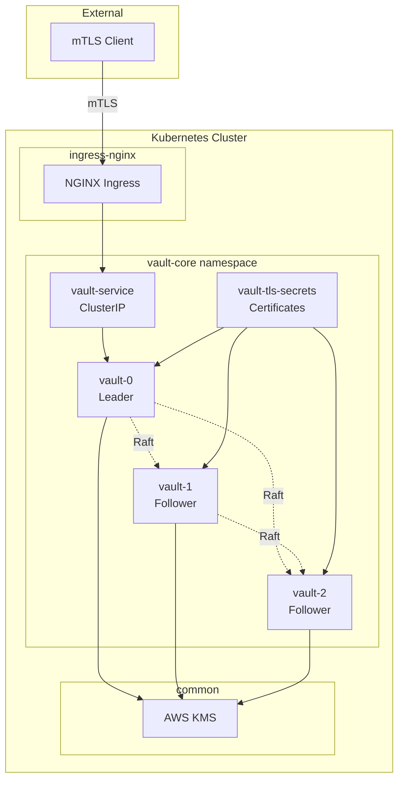

# 🏛️ Vault Kubernetes Lab

> **Production-Grade HashiCorp Vault Enterprise Deployment on Kubernetes**  
> *Modular • Secure • Scalable • Enterprise-Ready*

[](https://www.vaultproject.io/)
[](https://kubernetes.io/)
[](https://terraform.io/)
[](https://helm.sh/)
[](#-security--mtls)

---

## 🎯 **What This Lab Delivers**

A **battle-tested**, **production-ready** HashiCorp Vault Enterprise deployment featuring:

- 🔐 **Full mTLS Authentication** - Client & server certificate-based security
- 🏗️ **High Availability** - 3-node Raft consensus cluster with automatic failover
- 🚀 **Auto-Unsealing** - AWS KMS integration for seamless operations
- 🌐 **Ingress Ready** - NGINX with SSL passthrough for external access
- 📦 **Modular Architecture** - Terraform-driven, composable infrastructure

---

## 🏗️ **Architecture Overview**



---

## 🚀 **Quick Start**

### Prerequisites
- Docker Desktop with Kubernetes enabled
- AWS CLI configured with KMS permissions
- Vault Enterprise license file (if enterprise is enabled)
- Terraform 1.6+, kubectl, helm

### 1-Command Deployment
```bash
# Clone and deploy everything
git clone <your-repo>
cd vault-k8s-lab
task deploy:all
```

### Initialize & Test
```bash
# Initialize Vault cluster (first time only)
kubectl exec -it vault-0 -n vault-core -- vault operator init

# Join cluster members
kubectl exec -it vault-1 -n vault-core -- vault operator raft join \
  -leader-ca-cert="$(kubectl exec vault-1 -n vault-core -- cat /vault/userconfig/vault-tls/ca.crt)" \
  -leader-client-cert="$(kubectl exec vault-1 -n vault-core -- cat /vault/clientconfig/vault-tls/tls.crt)" \
  -leader-client-key="$(kubectl exec vault-1 -n vault-core -- cat /vault/clientconfig/vault-tls/tls.key)" \
  https://vault-0.vault-internal:8200

kubectl exec -it vault-2 -n vault-core -- vault operator raft join \
  -leader-ca-cert="$(kubectl exec vault-2 -n vault-core -- cat /vault/userconfig/vault-tls/ca.crt)" \
  -leader-client-cert="$(kubectl exec vault-2 -n vault-core -- cat /vault/clientconfig/vault-tls/tls.crt)" \
  -leader-client-key="$(kubectl exec vault-2 -n vault-core -- cat /vault/clientconfig/vault-tls/tls.key)" \
  https://vault-0.vault-internal:8200

# Setup client and test
export VAULT_ADDR="https://vault.local:8200"
export VAULT_CLIENT_CERT="./certificates/client.crt"
export VAULT_CLIENT_KEY="./certificates/client.key"
export VAULT_CACERT="./certificates/ca.crt"

vault status && echo "🎉 Vault is ready!"
```

---

## 📚 **Documentation Suite**

### 🏗️ **Infrastructure & Deployment**

| Document | Purpose | Key Features |
|----------|---------|--------------|
| **[Taskfile Guide](docs/taskfile.md)** | Automation & task management | Deployment workflows, layer management, operations |
| **[Base Infrastructure](docs/base.md)** | Common layer setup | Certificate Authority, AWS KMS, foundational resources |
| **[Helm Base Module](docs/helm-base-module.md)** | Reusable Helm deployment | Generic Helm chart deployment, configuration patterns |
| **[NGINX Ingress](docs/ingress-nginx.md)** | Ingress controller setup | SSL passthrough, load balancing, external access |

### 🔐 **Security & Certificates**

| Document | Purpose | Key Features |
|----------|---------|--------------|
| **[Certificate Generation](docs/certificate-generation-guide.md)** | Self-signed PKI creation | CA setup, server/client certs, mTLS preparation |

### 🏛️ **Vault Specific**

| Document | Purpose | Key Features |
|----------|---------|--------------|
| **[Server Deployment](docs/vault/server.md)** | Complete server setup guide | HA deployment, initialization, Raft clustering |
| **[Vault Module](docs/vault/module.md)** | Vault Helm module documentation | Configuration options, enterprise features, customization |
| **[Client Setup](docs/vault/client.md)** | Comprehensive client guide | Connection setup, authentication, operations |

### 🧪 **Testing & Operations**

For comprehensive testing and validation procedures, refer to the individual component guides above, each containing relevant testing sections and troubleshooting information.

---

## 🏗️ **Modular Architecture**

### Infrastructure Layers

```bash
stacks/
├── common/
│   └── layers/
│       └── ca/              # Certificate Authority & KMS
├── helm/
│   ├── base/               # Reusable Helm module
│   └── layers/
│       ├── ingress-nginx/  # Ingress controller
│       └── vault-core/     # Vault Enterprise cluster
```

### Deployment Automation

```bash
# Individual layer deployment
task deploy STACK=common LAYER=ca
task deploy STACK=helm LAYER=ingress-nginx
task deploy STACK=helm LAYER=vault-core

# Full stack deployment
task deploy:all

# Selective destruction
task destroy STACK=helm LAYER=vault-core
```

---

## 🔐 **Security & mTLS**

### **Production Security Features**

- ✅ **Mutual TLS (mTLS)** - Both client and server authentication
- ✅ **Separate Certificate Authorities** - Server CA & Client CA isolation
- ✅ **AWS KMS Auto-Unsealing** - No manual unseal operations

### **Certificate Architecture**

```bash
certificates/
├── server-ca.crt          # Server Certificate Authority
├── client-ca.crt          # Client Certificate Authority  
├── server.crt/.key        # Vault server certificates
└── client.crt/.key        # Client authentication certificates
```

### **mTLS Flow**

1. **Client** presents certificate signed by Client CA
2. **Server** validates client cert against Client CA
3. **Client** validates server cert against Server CA
4. **Encrypted** communication established

---

## 🔧 **Advanced Configuration**

### **Custom Helm Values**

```yaml
# stacks/helm/layers/vault-core/terraform.tfvars
helm_values = {
  server = {
    ha = {
      enabled = true
      replicas = 3
      raft = {
        enabled = true
        setNodeId = true
      }
    }
    enterpriseLicense = {
      secretName = "vault-license"
    }
  }
}
```

### **Environment Customization**

```bash
# Development
export VAULT_ENV=dev
task deploy:all

# Production  
export VAULT_ENV=prod
export VAULT_REPLICAS=5
task deploy:all
```

---

## 🛠️ **Troubleshooting**

### **Common Issues**

| Issue | Quick Fix | Reference |
|-------|-----------|-----------|
| Pod not starting | `kubectl describe pod vault-0 -n vault-core` | [Server Guide](docs/vault/server.md#troubleshooting) |
| mTLS connection fails | `openssl verify -CAfile ca.crt client.crt` | [Client Guide](docs/vault/client-setup-and-test.md#troubleshooting) |
| Raft consensus issues | `vault operator raft list-peers` | [Server Guide](docs/vault/server.md#raft-cluster-management) |
| Certificate expired | `./scripts/generate-certs.sh` | [Certificate Guide](docs/certificate-generation-guide.md#certificate-renewal) |

### **Health Checks**

```bash
# One-liner system health
kubectl get pods -n vault-core && vault status && vault operator raft list-peers
```

---

## 🤝 **Contributing**

This lab follows enterprise DevOps practices:

1. **Infrastructure as Code** - All changes via Terraform
2. **GitOps Workflow** - PR-based deployments
3. **Testing Required** - E2E tests must pass
4. **Documentation** - Update relevant guides
5. **Security Review** - mTLS and encryption validation

---

<div align="center">

*HashiCorp Vault • Kubernetes • Terraform • Helm • mTLS*

</div>