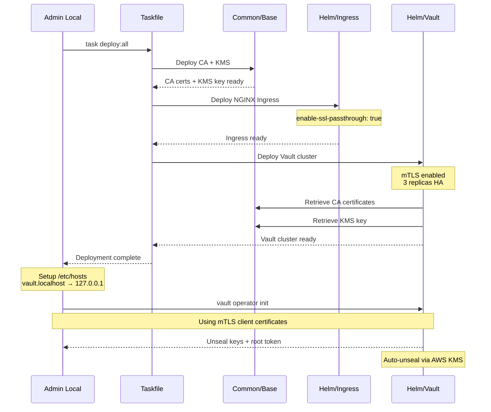
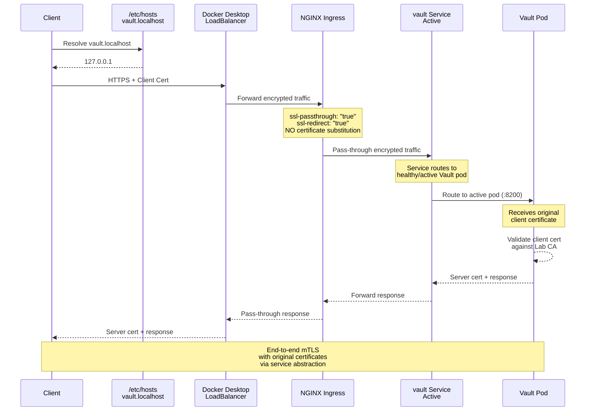
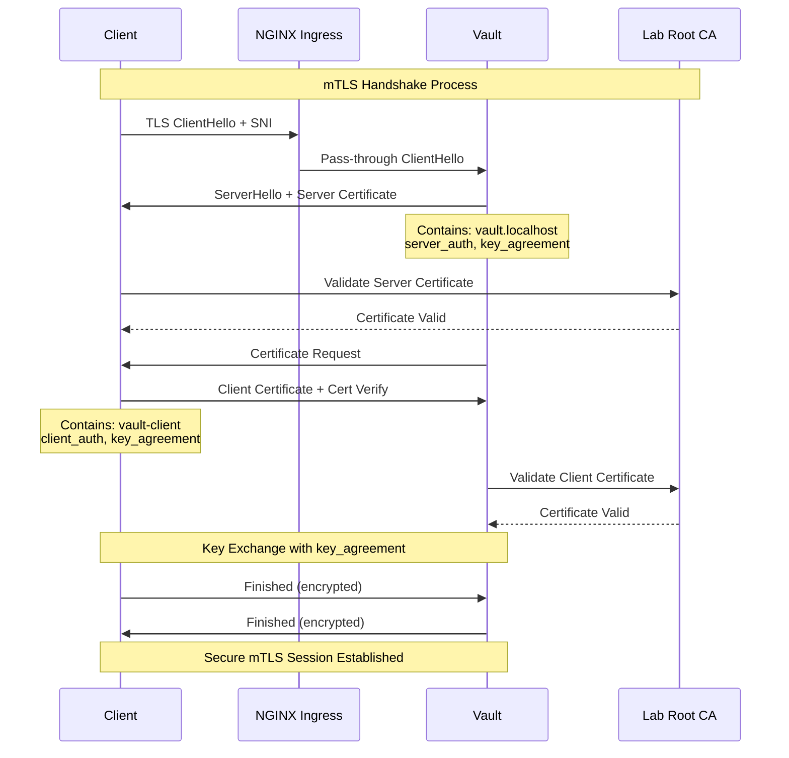

# Vault Module Documentation

## Overview

The Vault module provides a comprehensive, production-ready deployment of HashiCorp Vault on Kubernetes with advanced security features including **mutual TLS (mTLS)**, high availability, enterprise capabilities, and AWS KMS auto-unsealing. The module emphasizes **end-to-end encryption and certificate-based authentication** for maximum security.

## Architecture

### mTLS Architecture Layers

```
┌────────────────────────────────────────────────────────────────┐
│                    Certificate Authority Strategy              │
├────────────────────────────────────────────────────────────────┤
│                                                                │
│  Lab Root CA (Self-Signed)                                     │
│       │                                                        │
│       ├─── Server Certificates                                 │
│       │      ├─── vault.localhost                              │
│       │      ├─── vault-0.vault-internal                       │
│       │      ├─── vault-1.vault-internal                       │
│       │      └─── vault-2.vault-internal                       │
│       │                                                        │
│       └─── Client Certificates                                 │
│              ├─── Admin Client Cert                            │
│              ├─── Application Client Cert                      │
│              └─── Node Client Cert (inter-node)                │
│                                                                │
└────────────────────────────────────────────────────────────────┘
```

## Key Features

### 🔐 Mutual TLS (mTLS) - Primary Focus

#### What is mTLS?
mTLS extends standard TLS by requiring **both client and server** to authenticate using certificates:

```
Standard TLS:  Client → [Verify Server Cert] → Server
mTLS:          Client ←→ [Verify Both Certs] ←→ Server
```

#### Why key_agreement is Mandatory

The `key_agreement` usage is **critical** for mTLS certificates because:

- **ECDH Key Exchange**: Enables Elliptic Curve Diffie-Hellman key agreement
- **Perfect Forward Secrecy**: Each session uses unique encryption keys
- **TLS 1.2+ Compliance**: Required for modern cipher suites
- **Certificate Validation**: Without it, TLS handshake fails with "bad certificate" error

**Without key_agreement**: TLS handshake fails during key exchange phase  
**With key_agreement**: Secure session establishment with perfect forward secrecy

#### mTLS Benefits
- **Zero Trust Security**: Every connection requires certificate validation
- **Strong Authentication**: Certificate-based identity verification
- **Encrypted Communication**: End-to-end encryption at transport layer
- **Inter-Node Security**: Vault nodes authenticate to each other
- **API Security**: All Vault operations (init, join, admin) use mTLS

### 🌐 Ingress Configuration

#### Why SSL Passthrough is Critical

**1. `nginx.ingress.kubernetes.io/ssl-passthrough: "true"`**

**Purpose**: Preserves end-to-end mTLS encryption

```
Without SSL Passthrough:
Client → [mTLS] → Ingress → [Terminate SSL] → [New SSL] → Vault
                           ❌ Ingress cert used, client cert lost

With SSL Passthrough:
Client → [mTLS] → Ingress → [Pass-through] → Vault
                           ✅ Original certificates preserved
```

**2. `nginx.ingress.kubernetes.io/ssl-redirect: "true"`**

**Purpose**: Enforces HTTPS-only access and prevents accidental plaintext connections.

#### Local DNS Configuration

**Why add to `/etc/hosts`**:
```bash
echo "127.0.0.1    localhost vault.localhost" >> /etc/hosts
```

**Reasons**:
1. **Docker Desktop Integration**: Routes `vault.localhost` to local Kubernetes
2. **Certificate Validation**: Matches the CN/SAN in server certificates
3. **Development Environment**: Simulates production DNS without external DNS server

### 🏢 Enterprise Features

- **Advanced Replication**: Multi-region disaster recovery
- **HSM Integration**: Hardware security module support
- **Sentinel Policies**: Policy-as-code governance
- **License Management**: Automated license deployment

### 🔄 High Availability (HA)

- **No Single Point of Failure**: 3-node cluster survives 1 node failure
- **Automatic Failover**: Leader election and failover
- **Data Consistency**: Distributed consensus algorithm

### 🔑 AWS KMS Auto-Unseal

- **Automatic Unsealing**: No manual intervention required
- **Secure Key Management**: AWS manages encryption keys
- **Compliance**: Meets regulatory requirements

## Configuration Variables

### Security Features
| Variable | Type | Default | Description |
|----------|------|---------|-------------|
| `is_vault_mtls_enabled` | bool | `false` | **Enable mutual TLS authentication** |
| `is_vault_tls_enabled` | bool | `false` | Enable server TLS encryption |
| `is_vault_ingress_enabled` | bool | `false` | **Enable ingress with SSL passthrough** |
| `is_vault_aws_kms_enabled` | bool | `false` | Enable AWS KMS auto-unsealing |
| `is_vault_enterprise` | bool | `false` | Enable Vault Enterprise features |

### Network & Access
| Variable | Type | Default | Description |
|----------|------|---------|-------------|
| `vault_host` | string | `""` | External hostname (e.g., `vault.localhost`) |
| `is_vault_ui_enabled` | bool | `false` | Enable Vault web UI |
| `vault_replicas` | string | `"3"` | Number of Vault instances (HA) |

## Deployment Example

```terraform
module "vault-core" {
  source = "../../modules/vault"

  # mTLS Configuration
  is_vault_mtls_enabled           = true
  is_vault_tls_enabled            = true
  vault_client_tls_cert_dir       = "/path/to/client/certs"

  # Ingress Configuration
  is_vault_ingress_enabled        = true
  vault_host                      = "vault.localhost"
  is_vault_ui_enabled             = true

  # Enterprise & HA
  is_vault_enterprise             = true
  vault_license_file_path         = "/path/to/vault.hclic"
  vault_replicas                  = "3"

  # AWS KMS Unsealing
  is_vault_aws_kms_enabled        = true
  vault_aws_region                = "us-east-1"

  helm_namespace                  = "vault-core"
}
```

## Deployment Flow

The complete deployment process using Taskfile automation:



## Architecture Flows

### SSL Passthrough Flow



### mTLS Certificate Validation Flow



## Setup Instructions

### 1. Local DNS Configuration
```bash
# Add to /etc/hosts for local development
echo "127.0.0.1    localhost vault.localhost" | sudo tee -a /etc/hosts

# Verify DNS resolution
nslookup vault.localhost
```

### 2. Deploy Vault
```bash
# Deploy complete mTLS Vault cluster
task deploy:all

# Verify deployment
kubectl get pods -n vault-core
kubectl get ingress -n vault-core
```

### 3. Access Vault
```bash
# Export certificate paths for mTLS
export VAULT_ADDR="https://vault.localhost"
export VAULT_CACERT="/path/to/ca.crt"
export VAULT_CLIENT_CERT="/path/to/client.crt"
export VAULT_CLIENT_KEY="/path/to/client.key"

# Test connection
vault status
```

## Certificate Flow

### Certificate Chain
```
Lab Root CA (common/base)
    ├── Server Certificate (vault.localhost)
    │   ├── CN: vault.localhost
    │   ├── DNS: vault-*.vault-internal
    │   └── Usage: server_auth, key_agreement
    └── Client Certificate (vault-client)
        ├── CN: vault-client
        ├── Organization: HashiCorp
        └── Usage: client_auth, key_agreement  # Prevents "bad certificate"
```

### Key Process Steps
1. Client connects to vault.localhost (resolves to 127.0.0.1)
2. Docker Desktop routes to NGINX Ingress LoadBalancer
3. Ingress applies SSL passthrough (preserves client certificates)
4. Vault Service routes to healthy/active pod
5. Vault receives original mTLS connection
6. Mutual certificate validation occurs at Vault level
7. Secure session established with end-to-end encryption

## Troubleshooting

### Common Issues

**1. "bad certificate" error during TLS handshake**
- **Cause**: Missing `key_agreement` in certificate usage
- **Solution**: Ensure client certificates include `key_agreement` usage

**2. DNS resolution issues**
```bash
# Verify /etc/hosts entry
grep vault.localhost /etc/hosts
# Should show: 127.0.0.1    localhost vault.localhost
```

**3. SSL passthrough not working**
```bash
# Verify ingress annotations
kubectl get ingress -n vault-core vault -o yaml | grep -A3 annotations
# Should show ssl-passthrough: "true"
```

**4. Certificate validation failures**
```bash
# Test SSL connection
openssl s_client -connect vault.localhost:443 -servername vault.localhost

# Test with client certificate
openssl s_client -connect vault.localhost:443 \
  -cert client.crt -key client.key -CAfile ca.crt
```

## Security Best Practices

- **Certificate Rotation**: Implement automated certificate renewal
- **Local Development Only**: `/etc/hosts` method only for lab environments
- **Network Policies**: Implement network segmentation
- **Monitoring**: Log and monitor all certificate-based authentications

---

This module provides enterprise-grade Vault deployment with **military-grade mTLS security** and **secure ingress access**, ensuring that every connection is authenticated, encrypted, and verified through certificate-based mutual authentication with proper SSL passthrough for true end-to-end security.